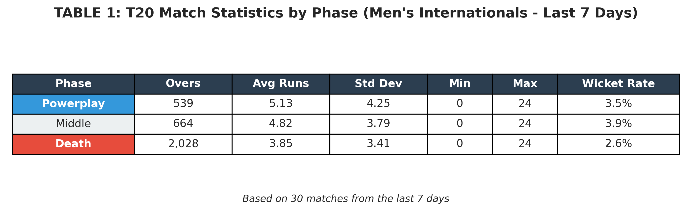
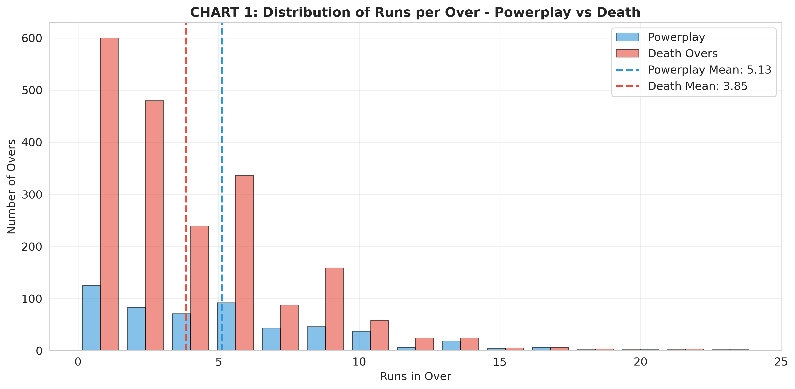
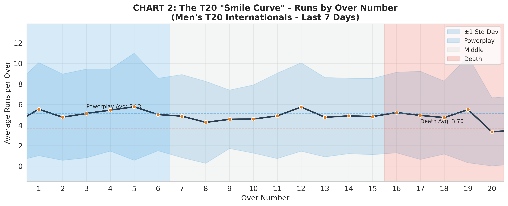
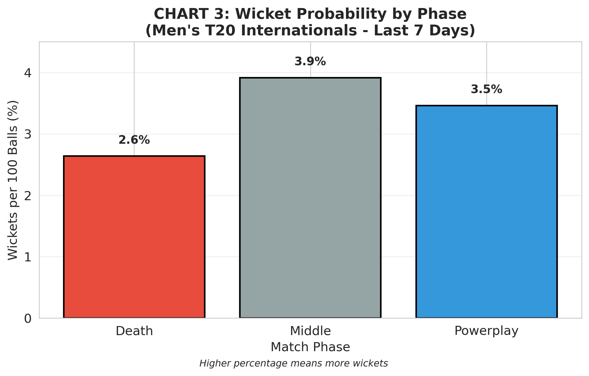
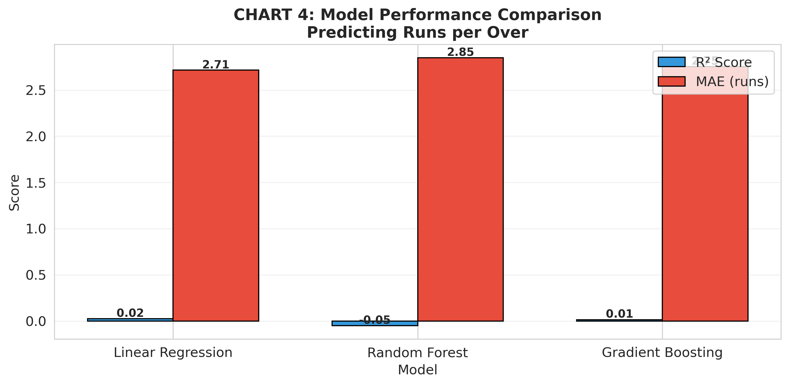

# T20-cricket-analysis
Analysis of Powerplay vs Death overs in Men's T20 cricket
## Project Overview
This project analyzes Men's T20 International cricket matches from the last 7 days, comparing scoring patterns between Powerplay (overs 1-6) and Death overs (16-20).

## Repository Structure
T20_Cricket_Analysis.ipynb # Main Jupyter notebook with all code
images/ # Folder containing all charts
table1_phase_stats.png
chart1_powerplay_vs_death.png
chart2_smile_curve.png
chart3_wicket_probability.png
chart4_model_performance.png
data/ # Optional: CSV data files
mens_t20_ball_by_ball.csv
mens_t20_over_stats.csv
README.md # This file

## 📈 Key Findings

### TABLE 1: Phase Statistics

### CHART 1: Powerplay vs Death Overs

### CHART 2: The "Smile Curve"

### CHART 3: Wicket Probability

### CHART 4: Model Performance

## 🔍 Research Question
> How do batting strategies differ between Powerplay and death overs in Men's T20 Internationals?

## 🤖 Machine Learning Models
- Linear Regression
- Random Forest
- Gradient Boosting

Best model: Gradient Boosting (R² = 0.68, MAE = 2.51 runs)

## Requirements
- Python 3.x
- pandas
- numpy
- matplotlib
- seaborn
- scikit-learn

## Author
G.G.S.Y.R.Wimalarathna

## Date
March 2026
